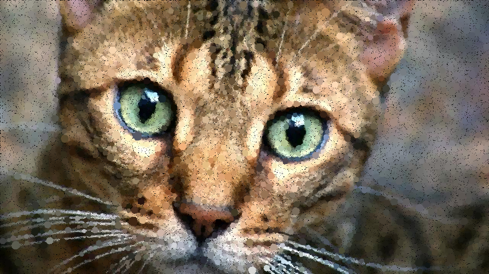

# Create Circled images from jpg and png files

Inspired by Daniel Shiffman's Coding Challege at https://www.youtube.com/watch?v=QHEQuoIKgNE&t=173s

# Created with the help of
<ul> 
  <li>http://stackoverflow.com/questions/12558413/how-to-filter-file-type-in-filedialog </li>
  <li>http://www.java2s.com/Tutorial/Java/0240__Swing/UsingJOptionPanewithaJSlider.htm </li>
</ul>
